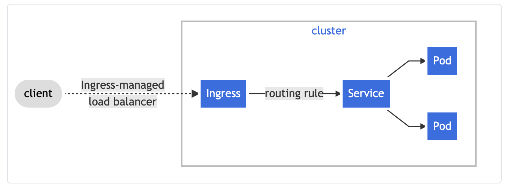
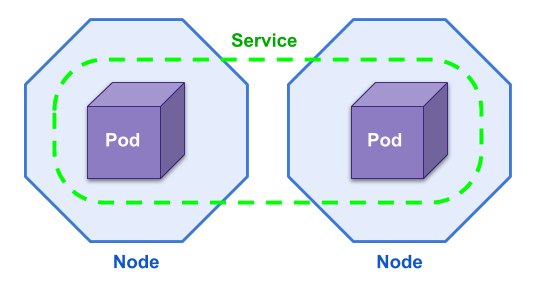
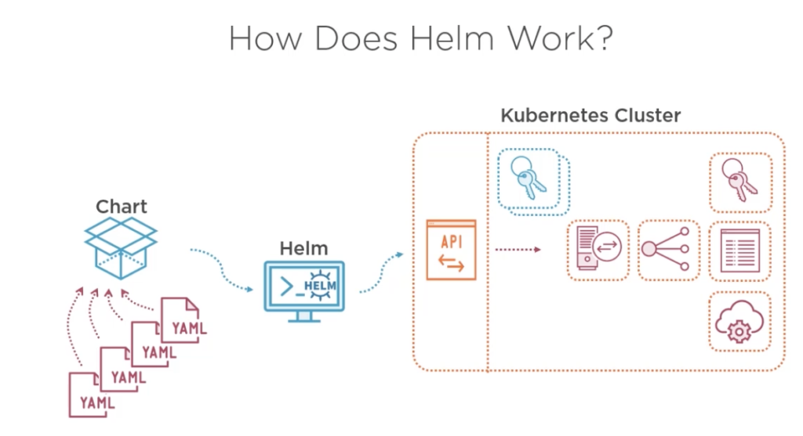

# workshop-k8s

## Step 1 - We need a Cluster 

### Structure of a cluster 


### Structure of a ultra simplified app



###How things are distributed




### How to create it via IaC 

```bash
import * as eks from "@pulumi/eks";

const cluster = new eks.Cluster("my-cluster");
export const kubeconfig = cluster.kubeconfig;
```

Some things to know : 
- The user that has created the cluster is cluster admin (except if you inject some config)
- There is a rbac that allow you to inject role ARN as cluster admin (we have done that ... twice)
- it is taking a while to create the cluster so let's use an existing one !

And that's all. 

## Step 2 - Now I want to connect

We use a mapping between our SSO role and the cluster RBAC to get a .kubeconfig. 

The file .kube/config represent your access to one or multiple cluster k8s (may be based on AWS sso login). 
I have setup my .aws/config as I encourage you to do on Starter Kit 

```bash
[~]$ cat .aws/config
[profile Admin-Staging]
sso_start_url = https://xxx.awsapps.com/start#/
sso_region = eu-central-1
sso_account_id = xxx
sso_role_name = Admin-Staging
region = eu-central-1
```


Login to SSO 
```bash 
aws sso login --profile Admin-Staging
```
Note : I'm using Admin-Staging access, but the SSO Group Dev also have the right to access namespace of ephemeral environement ! 

Then retrieve my kubeconfig from AWS and inject it on my local kube : 
```bash
aws eks update-kubeconfig --name staging-staging-cluster --profile Admin-Staging
```


The certificate looks like that : 
```bash
[~]$ cat .kube/config
apiVersion: v1
clusters:
- cluster:
    certificate-authority-data: [SKIPPED]
    server: https://xxx.yl4.eu-central-1.eks.amazonaws.com
  name: arn:aws:eks:eu-central-1:xxx:cluster/staging-staging-cluster
contexts:
- context:
    cluster: arn:aws:eks:eu-central-1:xxx:cluster/staging-staging-cluster
    user: arn:aws:eks:eu-central-1:xxx:cluster/staging-staging-cluster
  name: arn:aws:eks:eu-central-1:xxx:cluster/staging-staging-cluster
current-context: arn:aws:eks:eu-central-1:xxx:cluster/staging-staging-cluster
kind: Config
preferences: {}
users:
- name: arn:aws:eks:eu-central-1:xxx:cluster/staging-staging-cluster
  user:
    exec:
      apiVersion: client.authentication.k8s.io/v1alpha1
      args:
      - --region
      - eu-central-1
      - eks
      - get-token
      - --cluster-name
      - staging-staging-cluster
      command: aws
      env:
      - name: AWS_PROFILE
        value: Admin-Staging
```
And this allow me to have access to the cluster throught the kubectl command ! 

## Step 3 - We need to define our deployment

Let's take a little project as an example.

This is composed of 3 parts : 
- A JS Frontend working on vueJS which serving static file 
- A PHP Backend on Symfony 
- A websocket server 

So we will need 4 docker container : 
- PHP for interpreting PHP code
- Nginx for exposing PHP code
- Nginx for exposing Static file for front
- Node with socket stuff. 

For this specific use case, we will use a multiple container pod.

Which has we can do on ECS is a pod (service) that can run multiple pod (task).

### Helm Chart



```bash 
*[main][~/Documents/Projects/project/project-delivery]$ tree 
.
├── README.md
├── deploy.sh 
├── docs
└── mstaff
    ├── Chart.yaml
    ├── charts
    ├── templates
    │   ├── NOTES.txt
    │   ├── _helpers.tpl
    │   ├── backend
    │   │   ├── configmap-app.yml
    │   │   ├── deployment_backend.yaml
    │   │   ├── ingress.yaml
    │   │   └── service.yaml
    │   ├── frontend
    │   │   ├── configmap_app.yml
    │   │   ├── deployment_front.yaml
    │   │   ├── ingress.yaml
    │   │   └── service.yaml
    │   ├── serviceaccount.yaml
    │   ├── tests
    │   │   └── test-connection.yaml
    │   └── websocket
    │       ├── config-websocket.yml
    │       ├── deployment_websocket.yml
    │       ├── ingress.yaml
    │       └── service.yaml
    └── values.yaml
```


## Step 4 - We need to run our deployment ! 

```bash
 helm upgrade --install project-staging project -n project-staging
```


## Step 5 - Some tips 

### K9s is life


### Minikube for local testing

This allow you to have a (obviously) single node cluster locally.


[Install Minikube](https://kubernetes.io/fr/docs/tasks/tools/install-minikube/)

## What we don't have talk about

- HPA 
- PV/PVC/StorageClass 
- Cluster Administration 
- Rancher/ K8sUI
